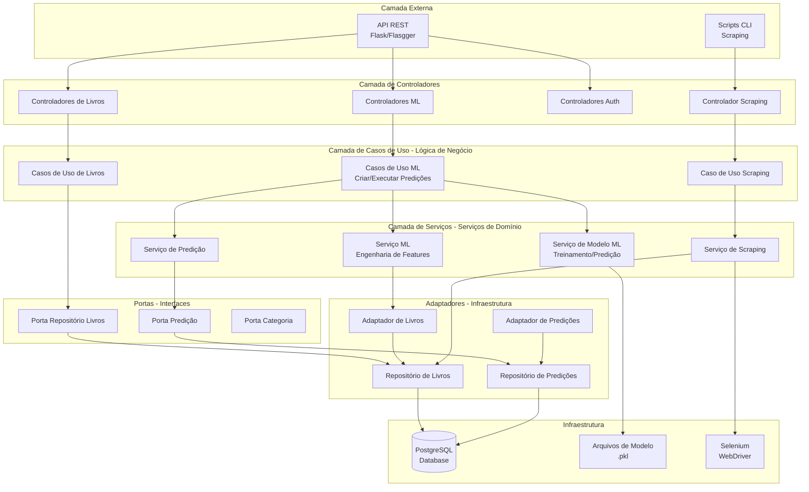
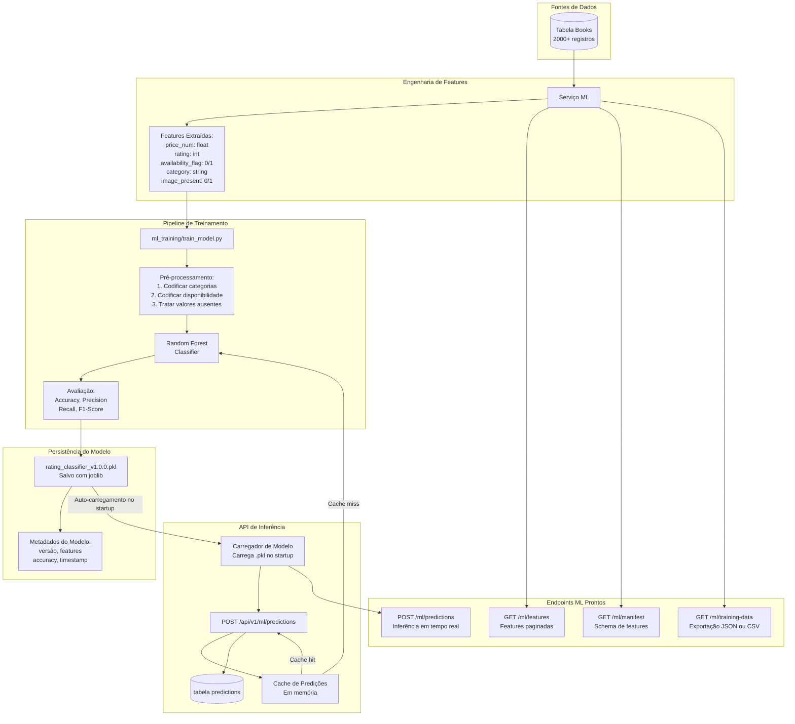
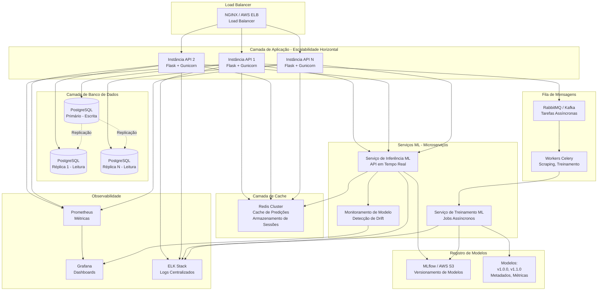
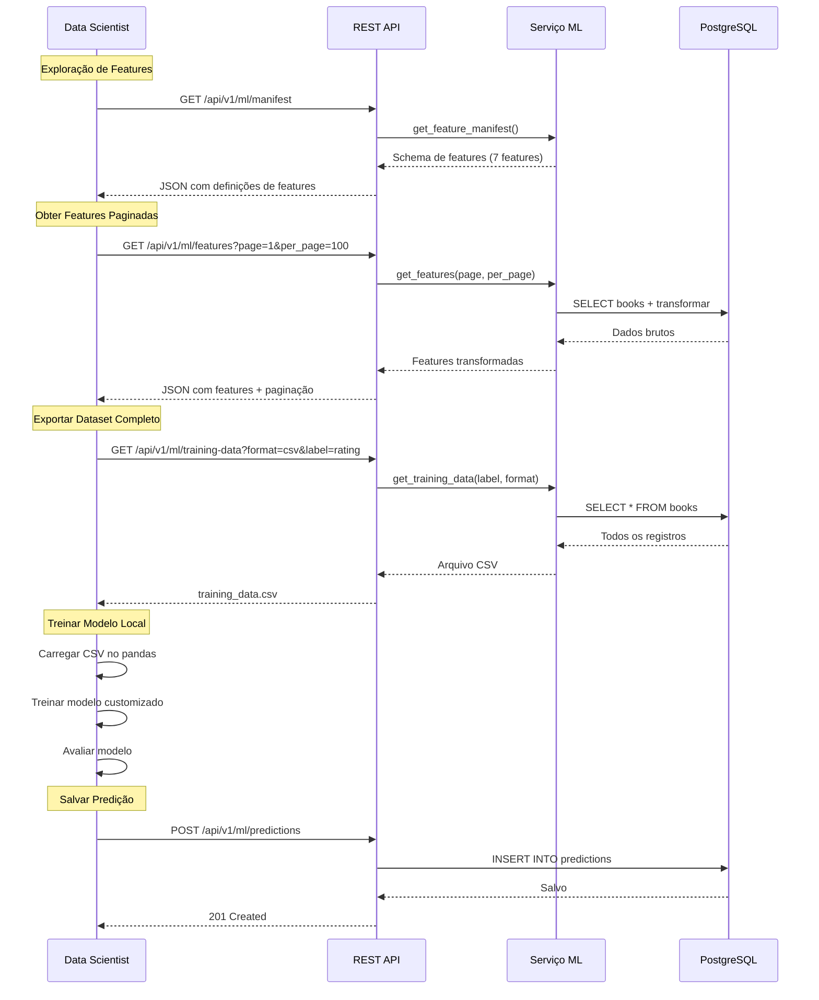
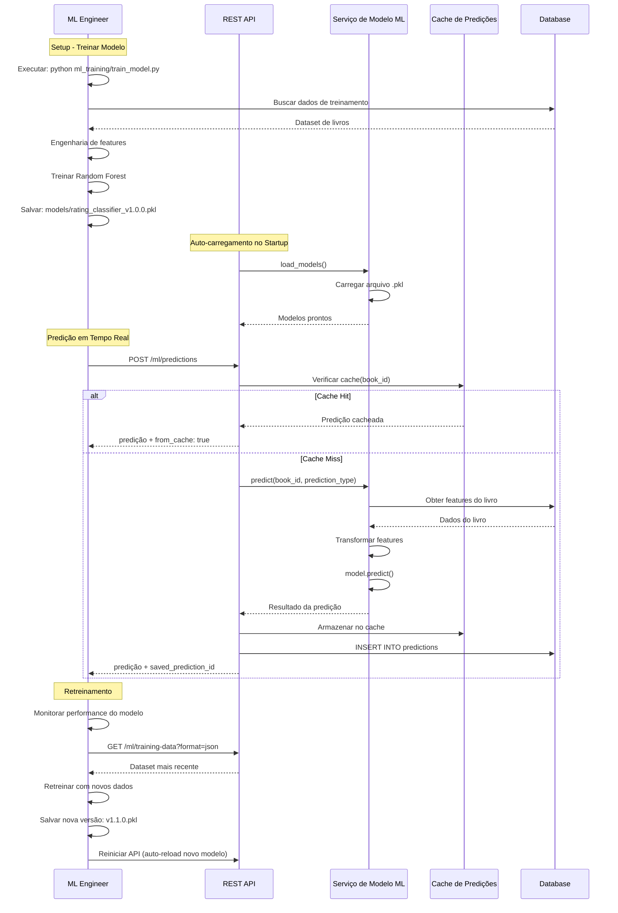

# Diagramas de Arquitetura - Tech Challenge Fase 1

Este documento contém os diagramas visuais da arquitetura completa do sistema, conforme solicitado pelo Tech Challenge.

---

## Índice

1. [Arquitetura Geral do Sistema (Clean/Hexagonal)](#1-arquitetura-geral-do-sistema-cleanhexagonal)
2. [Pipeline Completo de Dados](#2-pipeline-completo-de-dados)
3. [Integração Machine Learning](#3-integração-machine-learning)
4. [Arquitetura de Escalabilidade Futura](#4-arquitetura-de-escalabilidade-futura)
5. [Fluxo de Dados para Data Scientists](#5-fluxo-de-dados-para-data-scientists)
6. [Fluxo de Dados para ML Engineers](#6-fluxo-de-dados-para-ml-engineers)

---

## 1. Arquitetura Geral do Sistema (Clean/Hexagonal)

**Camadas da Arquitetura:**
- **Camada Externa:** Pontos de entrada (REST API, CLI)
- **Controladores:** Recebem requisições e orquestram casos de uso
- **Casos de Uso:** Lógica de negócio pura (independente de framework)
- **Serviços:** Serviços de domínio especializados (ML, Scraping)
- **Portas:** Interfaces que definem contratos
- **Adaptadores:** Implementações concretas das portas
- **Infraestrutura:** Persistência e recursos externos

---

## 2. Pipeline Completo de Dados

```mermaid
graph LR
    subgraph "INGESTÃO"
        WebSite[books.toscrape.com<br/>Website]
        Selenium[Selenium WebDriver<br/>Navegador Automatizado]
        Scraper[Serviço de Scraping<br/>Extração e Transformação]
    end

    subgraph "ARMAZENAMENTO"
        CSV[CSV Local<br/>data/books.csv]
        PostgreSQL[(PostgreSQL<br/>Database)]
        Tables[Tabelas:<br/>books, categories<br/>users, predictions]
    end

    subgraph "PROCESSAMENTO"
        FeatureEng[Engenharia de Features<br/>Serviço ML]
        Transform[Transformações:<br/>- price para float<br/>- availability para binário<br/>- category para codificado]
    end

    subgraph "MACHINE LEARNING"
        Training[Treinamento de Modelo<br/>Random Forest]
        ModelFile[rating_classifier_v1.0.0.pkl]
        Prediction[Serviço de Predição<br/>Inferência em Tempo Real]
    end

    subgraph "API PÚBLICA"
        RestAPI[REST API<br/>Flask + Swagger]
        Endpoints[Endpoints:<br/>/books<br/>/ml/features<br/>/ml/predictions]
    end

    subgraph "CONSUMO"
        DataScientist[Data Scientist<br/>Dados de Treinamento]
        MLEngineer[ML Engineer<br/>Predições]
        Apps[Apps Externos<br/>Recomendações de Livros]
    end

    WebSite -->|Requisições HTTP| Selenium
    Selenium -->|Parse HTML| Scraper
    Scraper -->|Escrever| CSV
    Scraper -->|Inserir| PostgreSQL
    PostgreSQL --> Tables

    Tables -->|Ler Livros| FeatureEng
    FeatureEng -->|Transformar| Transform
    Transform -->|Dataset| Training
    Training -->|Salvar Modelo| ModelFile

    Tables -->|Dados de Livros| RestAPI
    ModelFile -->|Carregar Modelo| Prediction
    Prediction -->|Inferência| RestAPI
    RestAPI --> Endpoints

    Endpoints -->|GET /ml/training-data| DataScientist
    Endpoints -->|POST /ml/predictions| MLEngineer
    Endpoints -->|GET /books| Apps
```

**Fluxo Completo:**
1. **Scraping:** Selenium navega no site, extrai dados, salva em CSV e PostgreSQL
2. **Engenharia de Features:** Transforma dados brutos em features para ML
3. **Treinamento:** Treina modelo Random Forest, salva arquivo .pkl
4. **API:** Expõe dados via endpoints REST
5. **Consumo:** Data Scientists, ML Engineers e Apps consomem a API

---

## 3. Integração Machine Learning

**Características Principais:**
- **Treinamento Automático:** Modelo treina na primeira inicialização se não estiver presente
- **Engenharia de Features:** 7 features extraídas (id, price_num, rating, availability_flag, category, image_present, title)
- **Modelo:** Random Forest Classifier para predição de rating alto/baixo (>=4 ou <4)
- **Cache:** Predições cacheadas para melhor performance
- **Persistência:** Todas as predições salvas no banco de dados

---

## 4. Arquitetura de Escalabilidade Futura

**Estratégias de Escalabilidade:**

### Escalabilidade Horizontal
- **Camada de API:** Múltiplas instâncias Flask + Gunicorn atrás de load balancer
- **Banco de Dados:** Replicação PostgreSQL (1 primário para escrita, N réplicas para leitura)
- **Cache:** Redis Cluster para distribuir carga

### Microserviços ML
- **Treinamento ML:** Serviço separado para retreinamento (assíncrono)
- **Inferência ML:** API dedicada para predições em tempo real
- **Monitoramento de Modelo:** Detecção de drift e degradação

### Processamento Assíncrono
- **Fila de Mensagens:** RabbitMQ/Kafka para tarefas assíncronas
- **Workers:** Celery para scraping e treinamento em background

### Observabilidade
- **Métricas:** Prometheus + Grafana (latência, throughput, erros)
- **Logs:** ELK Stack centralizado
- **Tracing:** Rastreamento distribuído (futuro: Jaeger/Zipkin)

### Registro de Modelos
- **MLflow:** Versionamento de modelos, métricas, experimentos
- **Armazenamento:** S3/MinIO para arquivos .pkl

---

## 5. Fluxo de Dados para Data Scientists

**Endpoints para Data Scientists:**
1. **GET /ml/manifest** - Entender schema de features
2. **GET /ml/features** - Obter features paginadas
3. **GET /ml/training-data** - Exportar dataset completo (JSON ou CSV)
4. **POST /ml/predictions** - Salvar predições de modelos externos

---

## 6. Fluxo de Dados para ML Engineers

**Fluxo de Trabalho para ML Engineers:**
1. **Treinamento:** Executar script de treinamento, salvar .pkl
2. **Deploy:** Modelo auto-carregado no startup da API
3. **Inferência:** POST /ml/predictions para predição em tempo real
4. **Cache:** Predições cacheadas para performance
5. **Retreinamento:** Buscar novos dados, retreinar, fazer deploy da nova versão
