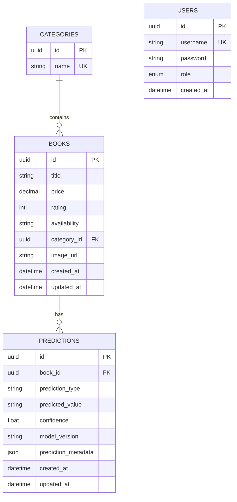

# Documentação do Banco de Dados

Este documento descreve o modelo de dados utilizado pela API de Livros, incluindo tabelas, campos, tipos e relacionamentos.

## Diagrama de Relacionamentos (ER)

**Legenda:**
- PK = Primary Key
- FK = Foreign Key
- UK = Unique Key

---

## Tabelas e Campos

### books
- **id**: UUID (PK)
- **title**: string
- **price**: decimal(10,2)
- **rating**: integer (1-5)
- **availability**: string
- **category_id**: UUID (FK para categories.id)
- **image_url**: string
- **created_at**: datetime
- **updated_at**: datetime

## categories
- **id**: UUID (PK)
- **name**: string (único)

## predictions *(Machine Learning)*
- **id**: UUID (PK)
- **book_id**: UUID (FK para books.id)
- **prediction_type**: string (ex: 'rating', 'category', 'price', 'recommendation')
- **predicted_value**: string
- **confidence**: float (0.0-1.0)
- **model_version**: string
- **prediction_metadata**: JSON (opcional)
- **created_at**: datetime
- **updated_at**: datetime

## users *(autenticação JWT)*
- **id**: UUID (PK)
- **username**: string (único)
- **password**: string
- **role**: enum('admin', 'user')
- **created_at**: datetime

---

### Observações
- Todos os IDs são do tipo UUID (ex: `550e8400-e29b-41d4-a716-446655440000`).
- O campo `role` da tabela `users` é um ENUM com os valores possíveis: 'admin', 'user'.
- Todas as tabelas estão implementadas e ativas.
- **Relacionamentos:**
  - `books.category_id` referencia `categories.id`
  - `predictions.book_id` referencia `books.id`
- **Constraints:**
  - `predictions.confidence` tem CHECK constraint (>= 0.0 AND <= 1.0)
  - Índices em `predictions.book_id`, `predictions.prediction_type`, `predictions.created_at`
- Datas em UTC.
